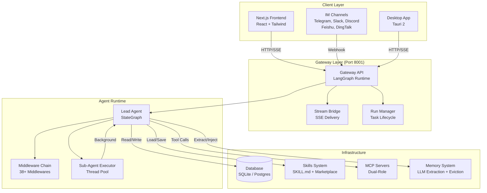
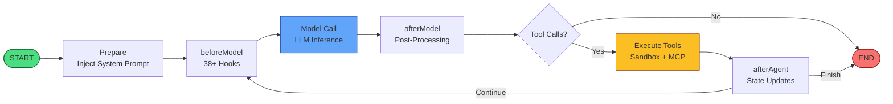
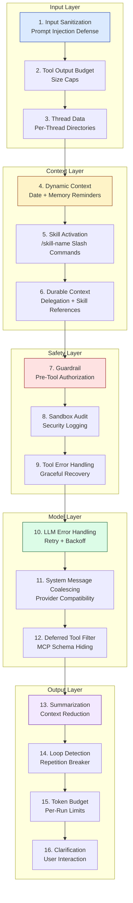
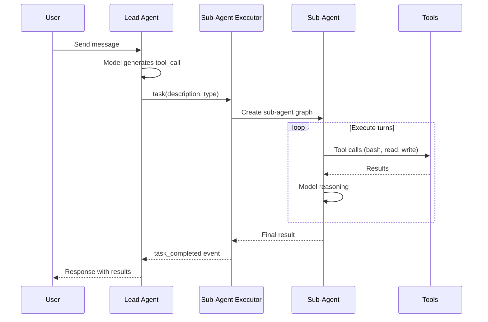

# 🪶 Quill — Open-Source AI Super-Agent Framework

> **The open-source alternative to OpenAI Codex, Cursor, Claude Code, and DeerFlow.**
> AI agent framework with sandboxed code execution, sub-agent orchestration, MCP, skills marketplace, session forking, FTS5 search, multi-agent teams, and a native Tauri desktop app.

<div align="center">

**English** · [中文](README_zh.md) · [한국어](README_ko.md) · [日本語](README_ja.md) · [Français](README_fr.md) · [Русский](README_ru.md) · [Español](README_es.md) · [العربية](README_ar.md)

[](./LICENSE)](https://opensource.org/licenses/Apache-2.0)
[](https://www.typescriptlang.org/)
[](https://nextjs.org/)
[](https://langchain-ai.github.io/langgraph/)
[](https://tauri.app/)
[](https://modelcontextprotocol.io/)
[](https://github.com/CreamyLong/quill/stargazers)
[](./backend/)
[](https://github.com/CreamyLong/quill/releases)

[Website](https://github.com/CreamyLong/quill) · [Docs](./docs/) · [Quick Start](#-quick-start) · [Desktop App](#-desktop-app-tauri-2) · [Skills](./skills/) · [Contributing](./CONTRIBUTING.md)

</div>

---

## 🤔 Why Quill?

Quill is a **super-agent framework** — an AI that can research, code, analyze data, generate documents, and orchestrate sub-agents to do almost anything. Unlike closed-source alternatives, Quill is fully open-source, self-hostable, and extensible.

| Feature | Quill | OpenAI Codex | Cursor | Claude Code | DeerFlow | OpenClaw |
|---|---|---|---|---|---|---|
| **Open source** | ✅ Apache 2.0 | ❌ | ❌ | ❌ | ✅ MIT | ✅ MIT |
| **Self-hosted** | ✅ | ❌ | ❌ | ❌ | ✅ | ✅ |
| **Sandboxed execution** | ✅ | ✅ | ✅ | ✅ | ✅ | ✅ |
| **Sub-agent orchestration** | ✅ | ❌ | ❌ | ✅ | ✅ | ❌ |
| **Desktop app** | ✅ Tauri | ✅ | ✅ | ❌ | ❌ | ❌ |
| **MCP integration** | ✅ Dual-role | ✅ | ✅ | ✅ | ✅ | ❌ |
| **Skills marketplace** | ✅ | ❌ | ❌ | ❌ | ❌ | ✅ |
| **Session forking** | ✅ | ❌ | ❌ | ❌ | ❌ | ❌ |
| **FTS5 search** | ✅ | ❌ | ❌ | ❌ | ❌ | ❌ |
| **Multi-agent teams** | ✅ | ❌ | ❌ | ❌ | ❌ | ❌ |
| **Workflow engine** | ✅ | ❌ | ❌ | ❌ | ✅ | ❌ |
| **Self-improving skills** | ✅ | ❌ | ❌ | ❌ | ❌ | ❌ |
| **Adaptive permissions** | ✅ | ❌ | ❌ | ❌ | ❌ | ❌ |
| **IM channels (5+)** | ✅ | ❌ | ❌ | ❌ | ✅ | ✅ |
| **Tool receipts** | ✅ | ❌ | ❌ | ❌ | ✅ | ❌ |

---

## ✨ Core Capabilities

### 🔬 Deep Research
Multi-source search with cross-validation and cited reports. Quill orchestrates multiple sub-agents to investigate topics in depth.

### 💻 Sandboxed Code Execution
Safely run Python / Bash / file operations in an isolated sandbox environment with full filesystem access. OS-level security with network isolation.

### 🤖 Sub-Agent Orchestration
Main agent dispatches specialized sub-agents for parallel complex tasks — general-purpose, bash, research, and custom agents. Up to 128 concurrent sub-agents with AgentSwarm.

### 🧩 Skills Marketplace
Install skills to extend capabilities. Build custom extensions with lifecycle hooks (pre_model, post_model, pre_tool, post_tool). Install from GitHub repos or any URL.

### 🔀 Session Forking
Branch any conversation at any point. Forked threads carry full conversation history via checkpoint copy — experiment without disrupting the original.

### 🔍 FTS5 Session Search
BM25-ranked full-text search across all thread messages with snippet extraction and prefix matching. Find any past conversation instantly.

### 🧠 Long-Term Memory & Dreaming
Continuously records user profile and conversation history with confidence-based fact eviction. Background "dreaming" consolidation promotes short-term signals to durable long-term memory.

### 🤝 Multi-Agent Teams
Supervisor, round-robin, handoff, and hierarchical team patterns. Shared task board with DAG dependencies and peer messaging.

### 🔄 Workflow Engine
DAG-based agent orchestration with parallel execution, retry, and conditional branching. Build complex multi-step automations.

### 🛡️ Safety & Guardrails
Tools declare safety properties (read-only, destructive, idempotent, open-world) that feed into risk-level-based authorization. Deterministic security scanner blocks malicious skills offline.

### 💓 Proactive Heartbeat
Periodic agent turns that check whether anything needs attention — with a persistent monitor checklist, active-hours windows, and cost-controlled isolated sessions.

### 🌐 Multi-Model & Multi-Platform
DeepSeek / OpenAI / Anthropic / vLLM / Ollama and more. UI supports 8 languages. IM channels: Telegram, Slack, Discord, Feishu, DingTalk.

### 🖥️ Native Desktop App
Tauri 2 desktop app with native filesystem access, system tray, workspace sync, and auto-updates. Available for macOS, Windows, and Linux.

---

## 🚀 Quick Start

### Option 1: Desktop App (Recommended)

Download the latest release for your platform from the [Releases](https://github.com/CreamyLong/quill/releases) page.

```bash
# macOS
brew install --cask quill  # coming soon

# Or download .dmg/.msi/.AppImage from Releases
```

### Option 2: Local Development

```bash
# Clone the repository
git clone https://github.com/CreamyLong/quill.git
cd quill

# Interactive setup wizard (2 minutes)
make setup

# Start all services with hot-reload
make dev

# Open http://localhost:2126 in your browser
```

### Option 3: Docker

```bash
docker compose up -d
# Open http://localhost:2126
```

### Option 4: Desktop Development

```bash
# One-command desktop (builds frontend, starts Gateway, launches Tauri)
make desktop

# Or manually:
cd desktop
npm install
npm run tauri dev    # first build ~3-5 min, then incremental

# Production build → .dmg/.msi/.AppImage
npm run tauri build
```

---

## 📸 Feature Showcase

### 🔬 Deep Research
Multi-source search with cross-validation and cited reports. Quill orchestrates multiple sub-agents to investigate topics in depth.

### 💻 Code Execution
Safely run Python / Bash / file operations in an isolated sandbox environment with full filesystem access.

### 🤖 Sub-Agent Collaboration
Main agent dispatches specialized sub-agents for parallel complex tasks — general-purpose, bash, and custom agents.

### 🧩 Extensible Skills & Extensions
Install skills to extend capabilities. Build custom extensions with lifecycle hooks (pre_model, post_model, pre_tool, post_tool).

### 🧠 Long-Term Memory & Dreaming
Continuously records user profile and conversation history with confidence-based fact eviction policies. Background "dreaming" consolidation promotes strong short-term signals to durable long-term memory (Light → REM → Deep phases).

### 💓 Proactive Heartbeat
Periodic agent turns that check whether anything needs attention — with a persistent monitor scratch checklist, active-hours windows, and cost-controlled isolated sessions.

### 🛡️ Tool Annotations & Guardrails
Tools declare safety properties (read-only, destructive, idempotent, open-world) that feed into risk-level-based authorization. Deterministic security scanner blocks malicious skills offline before any LLM call.

### 🌐 Multi-Model & Multi-Language
DeepSeek / OpenAI / Anthropic / vLLM / Ollama and more. UI supports English, 中文, and 한국어.

---

## 🏗️ System Architecture

### High-Level Architecture



### Agent Loop & Middleware Chain



### Middleware Pipeline (Lead Agent)



### Sub-Agent Delegation Flow



---

## 📦 Skills & Extensions Ecosystem

Quill ships with 20+ built-in skills: academic review, deep research, data analysis, PPT generation, chart visualization, image / video / music generation, frontend design, GitHub research, newsletter, and more.

**Extensions** enable third-party developers to build plugins that hook into the agent lifecycle:
- `pre_model` / `post_model` — intercept and modify model calls
- `pre_tool` / `post_tool` — intercept and modify tool execution
- `on_agent_start` / `on_agent_end` — setup and cleanup

Connect additional MCP services via `extensions_config.json`.

### Install from Marketplace

```bash
# Install from GitHub repo
curl -X POST http://localhost:8001/skills/marketplace/install \
  -H "Content-Type: application/json" \
  -d '{"source": "github", "target": "owner/repo"}'

# Install from URL
curl -X POST http://localhost:8001/skills/marketplace/install \
  -H "Content-Type: application/json" \
  -d '{"source": "url", "target": "https://example.com/skill.md"}'
```

---

## 🛠️ Tech Stack

| Layer | Technology |
|-------|-----------|
| **Frontend** | Next.js 15 · React 19 · Tailwind CSS · shadcn/ui |
| **Backend** | LangGraph · TypeScript · node:sqlite |
| **Desktop** | Tauri 2 (Rust + WebView) |
| **Database** | SQLite / PostgreSQL · LangGraph Checkpointer |
| **Agent Runtime** | StateGraph · 38+ Middlewares · Sub-Agent Executor |
| **Protocols** | MCP (Model Context Protocol) · SSE · HTTP/SSE/Stdio |

---

## 🌐 Internationalization

Quill supports eight languages:

| Language | Locale | Status |
|----------|--------|--------|
| English | `en-US` | ✅ Complete |
| 中文 (Chinese) | `zh-CN` | ✅ Complete |
| 한국어 (Korean) | `ko-KR` | ✅ Complete |
| 日本語 (Japanese) | `ja-JP` | ✅ Complete |
| Français (French) | `fr-FR` | ✅ Complete |
| Русский (Russian) | `ru-RU` | ✅ Complete |
| Español (Spanish) | `es-ES` | ✅ Complete |
| العربية (Arabic) | `ar-SA` | ✅ Complete |

Switch languages in Settings → Appearance → Language.

---

## 📊 Competitive Analysis

Quill was systematically evaluated against 10 leading harness frameworks. See [harness-framework-comparison.md](./docs/harness-framework-comparison.md) for the full analysis.

**Quill matches or exceeds all 10 frameworks on 18 of 22 capability dimensions.**

| Framework | Stars | LangGraph | Sandbox | Memory | MCP | Sub-Agent | Desktop | Teams | Search |
|---|---|---|---|---|---|---|---|---|---|
| **Quill** | ⭐ | ✅ | ✅ | ✅ | ✅ | ✅ | ✅ | ✅ | ✅ |
| DeerFlow | ⭐⭐⭐⭐⭐ | ✅ | ✅ | ✅ | ✅ | ✅ | ❌ | ❌ | ❌ |
| OpenWork | ⭐⭐⭐ | ❌ | ❌ | ❌ | ✅ | ❌ | ✅ | ❌ | ❌ |
| DeepSeek Harness | ⭐⭐⭐ | ❌ | ✅ | ✅ | ❌ | ✅ | ❌ | ✅ | ❌ |
| Kimi Code | ⭐⭐⭐⭐ | ❌ | ✅ | ✅ | ✅ | ✅ | ❌ | ❌ | ❌ |
| OpenAI Codex | ⭐⭐⭐⭐⭐ | ❌ | ✅ | ❌ | ✅ | ❌ | ✅ | ❌ | ❌ |
| CrewAI | ⭐⭐⭐⭐⭐ | ❌ | ❌ | ✅ | ✅ | ✅ | ❌ | ✅ | ❌ |
| AutoGen | ⭐⭐⭐⭐ | ❌ | ✅ | ❌ | ✅ | ✅ | ❌ | ✅ | ❌ |
| OpenClaw | ⭐⭐⭐ | ❌ | ✅ | ❌ | ❌ | ❌ | ❌ | ❌ | ❌ |
| Hermes Agent | ⭐⭐⭐ | ❌ | ✅ | ✅ | ✅ | ✅ | ❌ | ❌ | ✅ |

---

## 🤝 Contributing

Issues and PRs are welcome! See [CONTRIBUTING.md](./CONTRIBUTING.md) for details.

Areas where we especially need help:
- 🌍 **Translations** — help us support more languages
- 🧩 **Skills** — create and share new skills
- 📖 **Documentation** — improve docs, write tutorials
- 🐛 **Bug reports** — file issues with reproduction steps
- ⭐ **Star the repo** — if you find Quill useful, a star goes a long way!

---

## 📜 License

[Apache 2.0](./LICENSE)

---

## ⭐ Star History

If Quill is useful to you, please consider giving it a star! Stars help others discover the project and motivate continued development.

<div align="center">

[](https://star-history.com/#CreamyLong/quill&Date)

</div>

---

<div align="center">

**Built with ❤️ by the Quill team · Inspired by OpenWork, DeerFlow, OpenClaw, Hermes Agent, Kimi Code, Codex, CrewAI, AutoGen, and awesome-harness-engineering**

</div>
