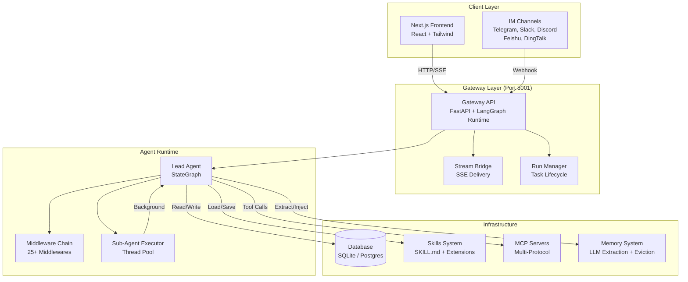
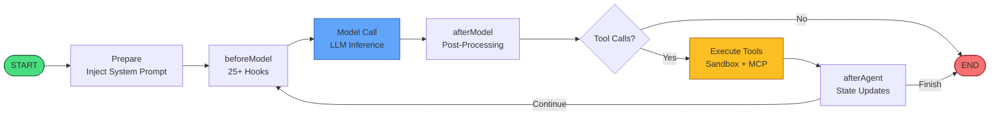
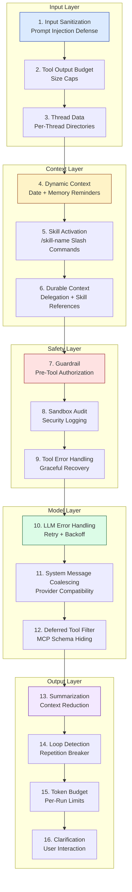
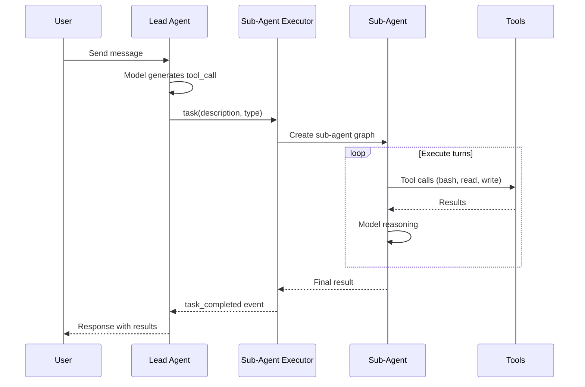
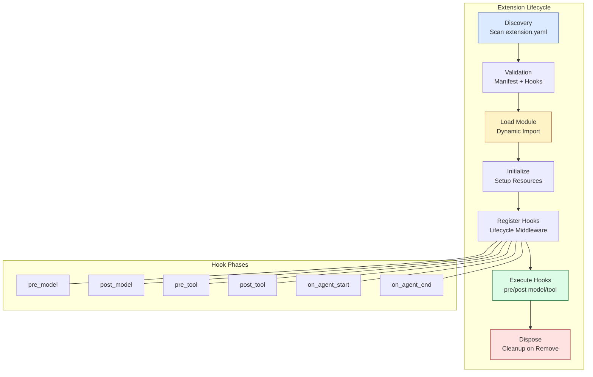

# 🪶 Quill

> Open-source AI work assistant — research, code, and create, all in one place

<div align="center">

**English** · [中文](README_zh.md) · [한국어](README_ko.md)

[](./LICENSE)
[](https://www.typescriptlang.org/)
[](https://nextjs.org/)
[](https://langchain-ai.github.io/langgraph/)

</div>

Quill is an open-source super agent framework. With sub-agent orchestration, sandbox execution, and an extensible skills system, it helps you accomplish multimodal work — research, coding, data analysis, document generation, and more.

---

## 📸 Feature Showcase

### 🔬 Deep Research
Multi-source search with cross-validation and cited reports. Quill orchestrates multiple sub-agents to investigate topics in depth.

### 💻 Code Execution
Safely run Python / Bash / file operations in an isolated sandbox environment with full filesystem access.

### 🤖 Sub-Agent Collaboration
Main agent dispatches specialized sub-agents for parallel complex tasks — general-purpose, bash, and custom agents.

### 🧩 Extensible Skills & Extensions
Install skills to extend capabilities. Build custom extensions with lifecycle hooks (pre_model, post_model, pre_tool, post_tool).

### 🧠 Long-Term Memory
Continuously records user profile and conversation history with confidence-based fact eviction policies.

### 🌐 Multi-Model & Multi-Language
DeepSeek / OpenAI / Anthropic / vLLM / Ollama and more. UI supports English, 中文, and 한국어.

---

## 🏗️ System Architecture

### High-Level Architecture



### Agent Loop & Middleware Chain



### Middleware Pipeline (Lead Agent)



### Sub-Agent Delegation Flow



### Extension System Architecture



---

## ✨ Core Capabilities

| Capability | Description |
|-----------|-------------|
| **Deep Research** | Multi-source search + cross-validation + cited reports |
| **Code Execution** | Safely run Python / Bash / file operations in a sandbox |
| **Sub-Agent Collaboration** | Main agent dispatches sub-agents for parallel complex tasks |
| **Extensible Skills** | Install skills to extend capabilities (academic review, PPT, charts, GitHub research, and more) |
| **Extension System** | Build plugins with lifecycle hooks (pre_model, post_model, pre_tool, post_tool) |
| **Long-Term Memory** | Continuously records user profile and conversation history with eviction policies |
| **Multi-Model** | DeepSeek / OpenAI / Anthropic / vLLM / Ollama and more |
| **Multi-Language** | UI supports English, 中文, 한국어 |
| **IM Channels** | Telegram, Slack, Discord, Feishu, DingTalk integration |
| **Scheduled Tasks** | Cron/interval-driven scheduled runs with multi-instance support |

---

## 🚀 Quick Start

### Prerequisites

- Node.js 22+ / pnpm 10+
- Python 3.12+ (optional, for sandbox execution)

### Local Development

```bash
git clone https://github.com/<your-org>/quill.git
cd quill
make setup        # interactive wizard, done in ~2 minutes
make dev          # start services, open http://localhost:2126
```

### Docker Deployment

```bash
docker compose up -d
```

---

## 🛠️ Tech Stack

| Layer | Technology |
|-------|-----------|
| **Frontend** | Next.js 15 · React 19 · Tailwind CSS · shadcn/ui |
| **Backend** | LangGraph · TypeScript · FastAPI (Python) |
| **Database** | SQLite / PostgreSQL · LangGraph Checkpointer |
| **Agent Runtime** | StateGraph · 25+ Middlewares · Sub-Agent Executor |
| **Protocols** | MCP (Model Context Protocol) · SSE · HTTP/SSE/Stdio |

---

## 📦 Skills & Extensions Ecosystem

Quill ships with 20+ built-in skills: academic review, deep research, data analysis, PPT generation, chart visualization, image / video / music generation, frontend design, GitHub research, newsletter, and more.

**Extensions** enable third-party developers to build plugins that hook into the agent lifecycle:
- `pre_model` / `post_model` — intercept and modify model calls
- `pre_tool` / `post_tool` — intercept and modify tool execution
- `on_agent_start` / `on_agent_end` — setup and cleanup

Connect additional MCP services via `extensions_config.json`.

---

## 🌐 Internationalization

Quill supports three languages:

| Language | Locale | Status |
|----------|--------|--------|
| English | `en-US` | ✅ Complete |
| 中文 (Chinese) | `zh-CN` | ✅ Complete |
| 한국어 (Korean) | `ko-KR` | ✅ Complete |

Switch languages in Settings → Appearance → Language.

---

## 🤝 Contributing

Issues and PRs are welcome. See [CONTRIBUTING.md](./CONTRIBUTING.md) for details.

## 📜 License

[Apache 2.0](./LICENSE)
