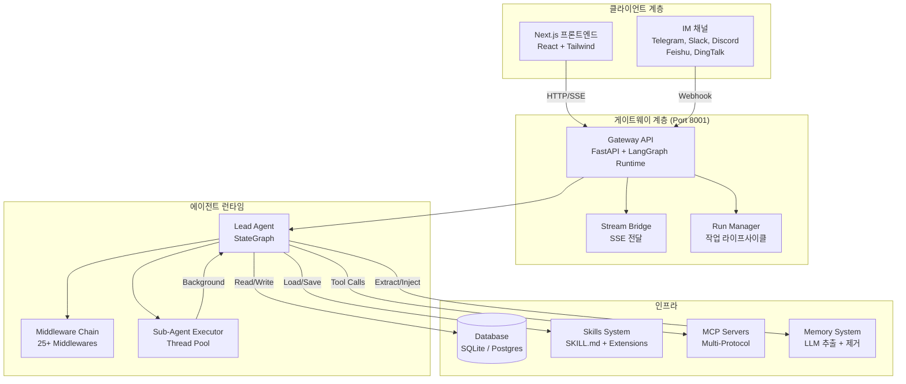
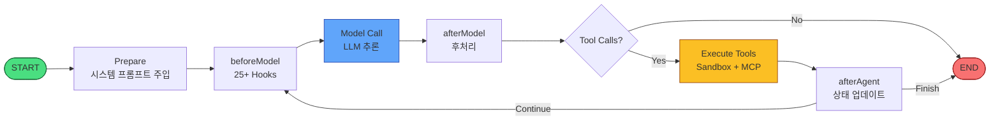

# 🪶 Quill

> 오픈소스 AI 업무 어시스턴트 — 연구, 코딩, 생성을 한 곳에서

<div align="center">

[English](README.md) · [中文](README_zh.md) · **한국어** · [日本語](README_ja.md) · [Français](README_fr.md) · [Русский](README_ru.md) · [Español](README_es.md) · [العربية](README_ar.md)

[](./LICENSE)
[](https://www.typescriptlang.org/)
[](https://nextjs.org/)
[](https://langchain-ai.github.io/langgraph/)

</div>

Quill은 오픈소스 슈퍼 에이전트 프레임워크입니다. 서브 에이전트 오케스트레이션, 샌드박스 실행, 확장 가능한 스킬 시스템을 통해 연구, 코딩, 데이터 분석, 문서 생성 등 다중 모달 업무를 수행할 수 있습니다.

---

## 📸 기능 쇼케이스

### 🔬 심층 연구
교차 검증 및 인용이 포함된 다중 소스 검색. Quill은 여러 서브 에이전트를 오케스트레이션하여 주제를 심층적으로 조사합니다.

### 💻 코드 실행
격리된 샌드박스 환경에서 Python / Bash / 파일 작업을 안전하게 실행합니다.

### 🤖 서브 에이전트 협업
메인 에이전트가 복잡한 작업을 위해 전문 서브 에이전트를 병렬로 디스패치합니다.

### 🧩 확장 가능한 스킬 및 확장
스킬을 설치하여 기능을 확장하세요. 라이프사이클 훅으로 사용자 지정 확장을 구축할 수 있습니다.

### 🧠 장기 메모리
신뢰도 기반 사실 정책으로 사용자 프로필과 대화 이력을 지속적으로 기록합니다.

### 🌐 다중 모델 및 다국어
DeepSeek / OpenAI / Anthropic / vLLM / Ollama 등. UI는 English, 中文, 한국어를 지원합니다.

---

## 🏗️ 시스템 아키텍처

### 상위 수준 아키텍처



### 에이전트 루프 및 미들웨어 체인



---

## ✨ 핵심 기능

| 기능 | 설명 |
|------|------|
| **심층 연구** | 다중 소스 검색 + 교차 검증 + 인용 보고서 |
| **코드 실행** | 샌드박스에서 Python / Bash / 파일 작업 안전하게 실행 |
| **서브 에이전트 협업** | 복잡한 작업을 위한 서브 에이전트 병렬 디스패치 |
| **확장 가능한 스킬** | 학술 리뷰, PPT, 차트, GitHub 연구 등 스킬 설치 |
| **확장 시스템** | 라이프사이클 훅으로 플러그인 구축 |
| **장기 메모리** | 신뢰도 기반 제거 정책으로 사용자 프로필 및 대화 이력 기록 |
| **다중 모델** | DeepSeek / OpenAI / Anthropic / vLLM / Ollama 등 |
| **다국어 지원** | UI는 English, 中文, 한국어 지원 |
| **IM 채널** | Telegram, Slack, Discord, Feishu, DingTalk 통합 |
| **예약 작업** | 다중 인스턴스 지원 cron/interval 기반 예약 실행 |

---

## 🚀 빠른 시작

### 사전 요구 사항

- Node.js 22+ / pnpm 10+
- Python 3.12+ (선택, 샌드박스 실행용)

### 로컬 개발

```bash
git clone https://github.com/<your-org>/quill.git
cd quill
make setup        # 대화형 마법사, 약 2분 소요
make dev          # 서비스 시작, http://localhost:2126에서 열기
```

### Docker 배포

```bash
docker compose up -d
```

---

## 🛠️ 기술 스택

| 계층 | 기술 |
|------|------|
| **프론트엔드** | Next.js 15 · React 19 · Tailwind CSS · shadcn/ui |
| **백엔드** | LangGraph · TypeScript · FastAPI (Python) |
| **데이터베이스** | SQLite / PostgreSQL · LangGraph Checkpointer |
| **에이전트 런타임** | StateGraph · 25+ Middlewares · Sub-Agent Executor |
| **프로토콜** | MCP (Model Context Protocol) · SSE · HTTP/SSE/Stdio |

---

## 📦 스킬 및 확장 에코시스템

Quill은 20개 이상의 기본 스킬을 제공합니다: 학술 리뷰, 심층 연구, 데이터 분석, PPT 생성, 차트 시각화, 이미지 / 비디오 / 음악 생성, 프론트엔드 디자인, GitHub 연구, 뉴스레터 등.

**확장**을 통해 타사 개발자가 에이전트 라이프사이클에 연결되는 플러그인을 구축할 수 있습니다:
- `pre_model` / `post_model` — 모델 호출 가로채기 및 수정
- `pre_tool` / `post_tool` — 도구 실행 가로채기 및 수정
- `on_agent_start` / `on_agent_end` — 설정 및 정리

`extensions_config.json`을 통해 추가 MCP 서비스를 연결하세요.

---

## 🌐 국제화

Quill은 세 가지 언어를 지원합니다:

| 언어 | 로케일 | 상태 |
|------|--------|------|
| English | `en-US` | ✅ 완료 |
| 中文 (Chinese) | `zh-CN` | ✅ 완료 |
| 한국어 (Korean) | `ko-KR` | ✅ 완료 |

설정 → 외관 → 언어에서 언어를 전환하세요.

---

## 🤝 기여

이슈와 PR을 환영합니다. 자세한 내용은 [CONTRIBUTING.md](./CONTRIBUTING.md)를 참조하세요.

## 📜 라이선스

[Apache 2.0](./LICENSE)
