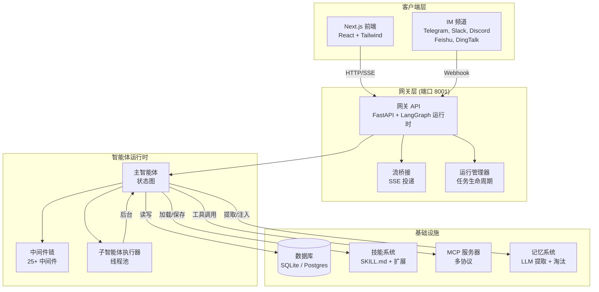
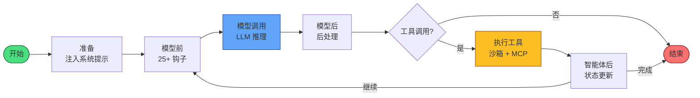

# 🪶 Quill

> 开源 AI 工作助手 — 研究、编码、创作，尽在一体

<div align="center">

[English](README.md) · **中文** · [한국어](README_ko.md) · [日本語](README_ja.md) · [Français](README_fr.md) · [Русский](README_ru.md) · [Español](README_es.md) · [العربية](README_ar.md)

[](./LICENSE)
[](https://www.typescriptlang.org/)
[](https://nextjs.org/)
[](https://langchain-ai.github.io/langgraph/)

</div>

Quill 是一个开源的超级智能体框架。通过子智能体编排、沙箱执行和可扩展的技能系统，帮助您完成多模态工作 — 研究、编码、数据分析、文档生成等等。

---

## 📸 功能展示

### 🔬 深度研究
多源搜索，交叉验证，生成带引用的报告。Quill 协调多个子智能体深入调查主题。

### 💻 代码执行
在隔离的沙箱环境中安全运行 Python / Bash / 文件操作。

### 🤖 子智能体协作
主智能体调度专门的子智能体并行处理复杂任务。

### 🧩 可扩展技能与插件
安装技能以扩展功能。使用生命周期钩子构建自定义扩展。

### 🧠 长期记忆
持续记录用户画像和对话历史，支持基于置信度的事实淘汰策略。

### 🌐 多模型与多语言
DeepSeek / OpenAI / Anthropic / vLLM / Ollama 等。界面支持 English、中文、한국어。

---

## 🏗️ 系统架构

### 高层架构



### 智能体循环与中间件链



---

## ✨ 核心能力

| 能力 | 描述 |
|------|------|
| **深度研究** | 多源搜索 + 交叉验证 + 带引用报告 |
| **代码执行** | 在沙箱中安全运行 Python / Bash / 文件操作 |
| **子智能体协作** | 主智能体调度子智能体并行处理复杂任务 |
| **可扩展技能** | 安装技能扩展功能（学术审查、PPT、图表、GitHub 研究等） |
| **扩展系统** | 使用生命周期钩子构建插件 |
| **长期记忆** | 持续记录用户画像和对话历史，支持淘汰策略 |
| **多模型** | DeepSeek / OpenAI / Anthropic / vLLM / Ollama 等 |
| **多语言** | 界面支持 English、中文、한국어 |
| **IM 频道** | Telegram、Slack、Discord、飞书、钉钉集成 |
| **定时任务** | 支持多实例的 cron/间隔调度执行 |

---

## 🚀 快速开始

### 前置要求

- Node.js 22+ / pnpm 10+
- Python 3.12+（可选，用于沙箱执行）

### 本地开发

```bash
git clone https://github.com/<your-org>/quill.git
cd quill
make setup        # 交互式向导，约 2 分钟完成
make dev          # 启动服务，在 http://localhost:2126 打开
```

### Docker 部署

```bash
docker compose up -d
```

---

## 🛠️ 技术栈

| 层级 | 技术 |
|------|------|
| **前端** | Next.js 15 · React 19 · Tailwind CSS · shadcn/ui |
| **后端** | LangGraph · TypeScript · FastAPI (Python) |
| **数据库** | SQLite / PostgreSQL · LangGraph Checkpointer |
| **智能体运行时** | StateGraph · 25+ 中间件 · 子智能体执行器 |
| **协议** | MCP (模型上下文协议) · SSE · HTTP/SSE/Stdio |

---

## 📦 技能与扩展生态系统

Quill 内置 20+ 技能：学术审查、深度研究、数据分析、PPT 生成、图表可视化、图片 / 视频 / 音乐生成、前端设计、GitHub 研究、新闻通讯等。

**扩展**允许第三方开发者构建插件，钩入智能体生命周期：
- `pre_model` / `post_model` — 拦截和修改模型调用
- `pre_tool` / `post_tool` — 拦截和修改工具执行
- `on_agent_start` / `on_agent_end` — 设置和清理

通过 `extensions_config.json` 连接更多 MCP 服务。

---

## 🌐 国际化

Quill 支持三种语言：

| 语言 | 区域设置 | 状态 |
|------|---------|------|
| English | `en-US` | ✅ 完成 |
| 中文 (Chinese) | `zh-CN` | ✅ 完成 |
| 한국어 (Korean) | `ko-KR` | ✅ 完成 |

在 设置 → 外观 → 语言 中切换语言。

---

## 🤝 贡献

欢迎提交 Issue 和 PR。详见 [CONTRIBUTING.md](./CONTRIBUTING.md)。

## 📜 许可证

[Apache 2.0](./LICENSE)
